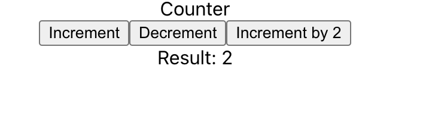

# Redux Toolkit Introduction

## How to run project

1. Step 1: yarn
2. Step 2: yarn start

## Requirements

1. add logic in `counter.ts` in `slices` folder
2. create store in `store.ts` file
3. provide th app for the whole

## Screenshot

